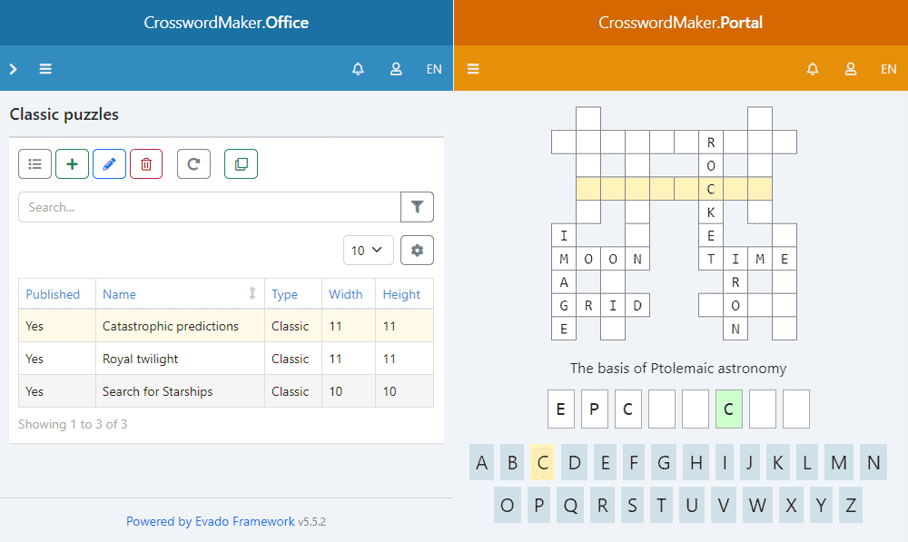

# Crossword Maker

This is a web app for creating and solving crossword puzzles:

- contains a large database of words;
- provides support for different languages;
- allows you to create thematic crosswords;
- edits puzzles, words, clues, themes and languages;
- allows multiple clues per word;
- implements both manual and automatic filling of crossword grids;
- imports new words and clues from prepared lists;
- export crossword puzzles to PDF.

The Crossword Maker is powered by 
[Evado Declarative Framework](https://github.com/mkhorin/evado), 
which allows you to modify not only data, 
but also the whole app using web interface.

[](https://mkhorin.github.io/evado-site/)

## Docker installation

Clone application to `/app`
```sh
cd /app
docker-compose up -d mongo
docker-compose up --build installer
docker-compose up -d server
```

## Typical installation

#### Install environment
- [Node.js](https://nodejs.org) (version 20)
- [MongoDB](https://www.mongodb.com/download-center/community) (version 5)

#### Linux
Copy files from repository to `/app`
```sh
cd /app
npm install
NODE_ENV=development node console/install
```

#### Windows
Copy files from repository to `c:/app`
```sh
cd c:/app
npm install
set NODE_ENV=development
node console/install
```

## Start app

#### Linux
```sh
cd /app
NODE_ENV=development node console/start
```

#### Windows
```sh
cd c:/app
set NODE_ENV=development
node console/start
```

## Usage

Web interface `http://localhost:3000`

Sign in as administrator:
```sh
Email: a@a.a
Password: 123456
```

## Tutorial
- [Build an App Without Coding](https://mkhorin.github.io/evado-site/)